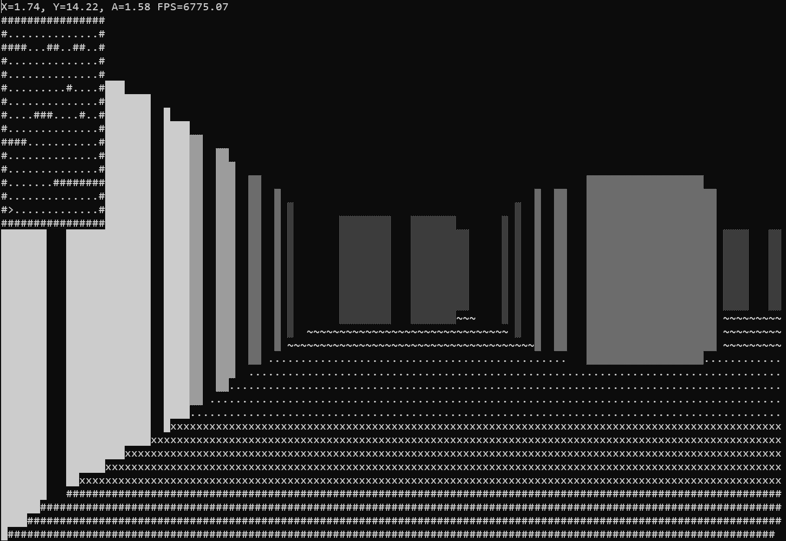

# Console First-Person Maze

A simple first-person maze navigation game built using C++ with console-based rendering. This project demonstrates ray-casting techniques to render a 3D-like environment in a text-based console.

## Features

- **3D Console Rendering**: Simulates a 3D environment using ASCII characters for walls, ceilings, and floors.
- **Ray-Casting Engine**: Implements a basic ray-casting algorithm to render the environment.
- **Player Movement**: Move forward, backward, strafe, and turn to explore the maze.
- **Dynamic Lighting**: Adjusts shading for walls and floors based on distance to simulate depth perception.
- **Minimap**: Displays a top-down view of the maze with the player's position and direction.

## Screenshots




> Replace the placeholders (`./screenshots/gameplay-example.png` and `./screenshots/minimap-example.png`) with the actual paths to your screenshots. Save your images in a `screenshots` folder in the repository.


## Controls

- `W`: Move forward
- `S`: Move backward
- `A`: Strafe left
- `D`: Strafe right
- `←`: Turn left
- `→`: Turn right

## How It Works

**Example Code:**
```cpp
for (int x = 0; x < nScreenWidth; x++) {
    float fRayAngle = (fPlayerA - fFOV / 2.0f) + ((float)x / (float)nScreenWidth) * fFOV;
    float fDistanceToWall = 0;
    bool bHitWall = false;

    float fEyeX = sinf(fRayAngle); // Unit vector for ray
    float fEyeY = cosf(fRayAngle);

    while (!bHitWall && fDistanceToWall < fDepth) {
        fDistanceToWall += 0.1f;
        int nTestX = (int)(fPlayerX + fEyeX * fDistanceToWall);
        int nTestY = (int)(fPlayerY + fEyeY * fDistanceToWall);

        if (nTestX < 0 || nTestX >= nMapWidth || nTestY < 0 || nTestY >= nMapHeight) {
            bHitWall = true;
            fDistanceToWall = fDepth; // Out of bounds
        } else if (map[nTestY * nMapWidth + nTestX] == '#') {
            bHitWall = true;
        }
    }
}
```
### Rendering

- Uses ray-casting to simulate a 3D environment. Rays are cast from the player's perspective to detect walls and calculate their distance.
- Wall heights are determined based on the distance from the player, creating a depth effect.
- Floors and ceilings are shaded differently to add realism.

### Collision Detection

- Prevents the player from walking through walls by detecting collisions and stopping movement when encountering obstacles.

```cpp
void MovePlayer(float& x, float& y, float angle, float elapsedTime, bool forward) {
    float moveStep = forward ? fSpeed : -fSpeed;
    x += sinf(angle) * moveStep * elapsedTime;
    y += cosf(angle) * moveStep * elapsedTime;

    if (map[(int)y * nMapWidth + (int)x] == '#') {
        x -= sinf(angle) * moveStep * elapsedTime;
        y -= cosf(angle) * moveStep * elapsedTime;
    }
}
```

### Minimap

- A top-down 2D view of the maze is rendered in the console, showing the player's position (`^`, `v`, `<`, `>`).

```cpp
for (int nx = 0; nx < nMapWidth; nx++) {
    for (int ny = 0; ny < nMapHeight; ny++) {
        screen[(ny + 1) * nScreenWidth + nx] = map[ny * nMapWidth + nx];
    }
}
screen[((int)fPlayerY + 1) * nScreenWidth + (int)fPlayerX] = '^'; // Player
```

## Map Layout

The map is a 16x16 grid defined in the code, where:

- `#` represents walls.
- `.` represents open space.

```cpp
wstring map =
L"################"
L"#..............#"
L"####...##..##..#"
L"#..............#"
L"#..............#"
L"#.........#....#"
L"#..............#"
L"#....###....#..#"
L"#..............#"
L"############...#"
L"#..............#"
L"#..............#"
L"#.......########"
L"#..............#"
L"#..............#"
L"################";
```

## What is Raycasting?

Raycasting is a computational technique used to simulate 3D environments by projecting rays from a player's perspective into a virtual world. It calculates how these rays interact with objects in the environment, such as walls, and determines what the player sees based on these interactions. 

### How It Works in This Project

1. **Field of View (FOV)**:
   - The player has a field of view (FOV) represented as an angle (e.g., 45 degrees).
   - Rays are cast from the player's position, spanning the width of the FOV.

2. **Casting Rays**:
   - Each ray is traced from the player's position at a specific angle.
   - The ray "travels" until it hits a wall or exceeds the maximum view distance (`fDepth`).

3. **Calculating Distance**:
   - When a ray hits a wall, the distance from the player to the wall is calculated.
   - This distance is used to determine how tall the wall appears on the screen (closer walls are taller; farther walls are shorter).

4. **Shading**:
   - Walls are shaded differently based on distance, simulating depth.
   - Close walls are bright and solid, while distant walls fade with lighter shading characters.
```cpp
     short nShade = ' ';
if (fDistanceToWall <= fDepth / 4.0f) nShade = 0x2588; // Very close
else if (fDistanceToWall < fDepth / 3.0f) nShade = 0x2593; // Close
else if (fDistanceToWall < fDepth / 2.0f) nShade = 0x2592; // Medium
else if (fDistanceToWall < fDepth) nShade = 0x2591; // Far
if (bBoundary) nShade = ' '; // Light boundary shading
```

5. **Boundary Detection**:
   - Special calculations check if the ray hits a boundary (e.g., between two wall segments).
   - This adds subtle visual effects to differentiate edges for realism.

6. **Floor and Ceiling**:
   - The floor and ceiling are rendered with characters representing various levels of shading.
   - The shading changes based on the distance from the player, creating a perspective effect.

### Benefits of Raycasting

- **Efficiency**:
  Raycasting focuses only on visible parts of the environment, making it computationally efficient compared to rendering entire 3D environments.

- **Simplicity**:
  Raycasting uses simple geometry and trigonometry, making it accessible for 2D-to-3D rendering.

### Applications

Raycasting was popularized in early 3D games, such as:
- **Wolfenstein 3D**: One of the first 3D first-person shooters.
- **Doom**: Used advanced raycasting techniques for immersive gameplay.

In this project, raycasting is implemented to create a 3D-like environment within the constraints of a console-based application.

